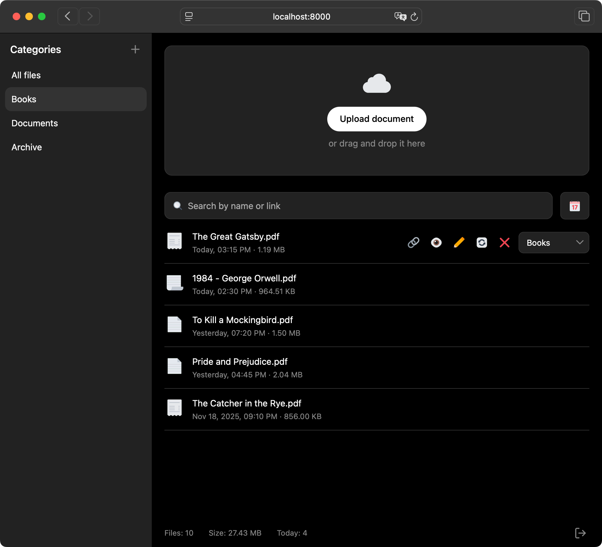

# Simple File Sharing

A minimalist file sharing application for personal use with password protection.




Live Demo: [filesharing-demo.timur.ee](filesharing-demo.timur.ee)


## Features

- 📤 **File Upload** - Drag and drop or button upload
- 🔗 **Quick Sharing** - Copy shareable links with one click
- 📁 **Categories** - Organize files into custom categories
- 🔍 **Search** - Find files by name or link
- 📊 **Sorting** - Sort by date or size
- ✏️ **Rename** - Change file names while keeping the same link
- 🔄 **Replace** - Update file content without changing the link
- 🗑️ **Delete with Undo** - 4-second undo window for deletions
- � **Password Protection** - Secure login with progressive lockout
- 🎨 **Dark Mode** - Automatic theme based on system preferences

## Installation

### 1. Upload Files

Upload all files to your web hosting (Apache with PHP support).

### 2. Set Permissions

Make sure these directories have write permissions:

```bash
chmod 755 data/
chmod 755 s/
```

### 3. Configure Password

**Default password:** `DemoPassword`

⚠️ **Change this immediately in production!**

To set a new password, generate a hash and update `auth.php`:

```bash
# Generate a new password hash
php -r "echo password_hash('your-password-here', PASSWORD_BCRYPT, ['cost' => 12]);"
```

Copy the output and replace the hash in `auth.php`:

```php
define('PASSWORD_HASH', 'your-generated-hash-here');
```

### 4. Access the Application

Open your site in a browser and log in with your password.

## File Structure

```
/
├── index.php           # Main application page
├── login.php           # Login page
├── logout.php          # Logout handler
├── auth.php            # Authentication logic
├── api.php             # Backend API
├── app.js              # Frontend JavaScript
├── style.css           # Styles
├── .htaccess           # Apache configuration
├── 404.html            # Custom 404 page
├── data/
│   └── files.json      # File metadata (JSON database)
├── s/                  # Uploaded files directory
│   └── xxxxx.ext       # Files with 5-char IDs
├── icons/              # UI icons
└── demo/               # Demo site
```

## Usage

1. **Login** - Enter your password to access the application
2. **Upload** - Drag and drop files or click "Upload document"
3. **Copy Link** - Click the copy icon to get a shareable link
4. **Share** - Send links in the format `https://your-domain.com/s/xxxxx.pdf`
5. **Organize** - Create categories and assign files to them
6. **Search** - Use the search bar to find files quickly

## Security Features

### Password Protection
- All pages except file downloads require authentication
- Progressive lockout after failed login attempts:
  - 3 attempts: Warning message
  - 5 attempts: Login disabled until session expires

### File Access
- Uploaded files in `/s/` directory are publicly accessible by direct link
- Admin interface (`index.php`, `api.php`) requires authentication
- Session-based authentication with secure logout

### Recommendations
- Use a strong password (12+ characters, mixed case, numbers, symbols)
- Enable HTTPS on your hosting
- Regularly backup the `data/` directory
- Consider adding IP-based restrictions in `.htaccess` if needed
- Set appropriate file upload limits in `.htaccess`

## Configuration

### Upload Limits

Edit `.htaccess` to change upload limits:

```apache
php_value upload_max_filesize 100M
php_value post_max_size 100M
```

Also update `api.php`:

```php
define('MAX_FILE_SIZE', 100 * 1024 * 1024); // 100MB
```

### Default Category

The default category "All Files" is created automatically and cannot be deleted or renamed.

## Requirements

- **PHP** 7.0 or higher
- **Apache** with mod_rewrite enabled
- **Write permissions** for `data/` and `s/` directories
- **Session support** enabled in PHP

## Browser Support

- Chrome/Edge (latest)
- Firefox (latest)
- Safari (latest)

## Troubleshooting

### Files not uploading
- Check directory permissions (`chmod 755 data/ s/`)
- Verify upload limits in `.htaccess` and `php.ini`
- Check PHP error logs

### Can't login
- Verify password hash in `auth.php`
- Clear browser cookies and try again
- Check if sessions are enabled in PHP

### 404 errors
- Ensure `.htaccess` is uploaded
- Verify mod_rewrite is enabled on Apache
- Check file permissions

## License

MIT License - Free for personal and commercial use.

## Contributing

This is a personal project, but suggestions and improvements are welcome via issues.

## Disclaimer

This application is designed for personal use. While it includes basic security features, it's recommended to:
- Use HTTPS
- Keep backups
- Monitor access logs
